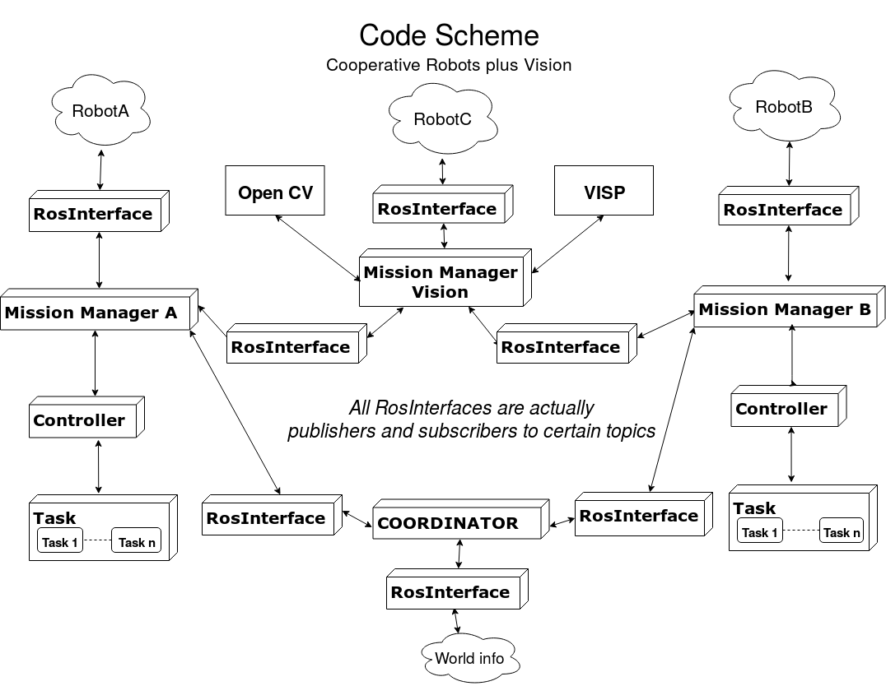

# AUV-Coop-assembly
### MASTER THESIS Robotics Engineering (In Development)
[Documentation](https://torydebra.github.io/AUV-Coop-Assembly/)


## Workspace folders (all in development)
#### src/peg (catkin package)
The "only kinematic" package, simulated with UWsim.  
Folder "toBeAdded_uwsim":
* model & scenes subfolders in uwsim/data/scenes (along with default scenes and models)
* terrain & objects in ~/.uwsim/data  
#### src/peg_dynamics (catkin package)
Package with dynamics of vehicle and arm. The dynamics is provided by FreeFloatingGazebo, a plugin which use Gazebo and UWSim functionalities.  
Folder "tobeAdded_freeFloatDemo":
* objects, terrain, scenes, urdf in src folder of freeFloatingGazebo_demo (Maybe also in .uwsim/data?)
* lauch folder also in src folder of freeFloatingGazebo_demo, but maybe other launches can be written accordingly to peg_dynamics package.

#### matlab folder
matlab code for plotting test

#### model folder
folder needed by kdlHelper (inside the packages) to parse the robot model and build the jacobian (the KDLHelper).

#### Others?
TODO: better put as separate package various support/helper classes that have no differences for kineatic and dynamic version.


## Code Schemes




## Dependencies
#### Simulators
* [**UWSim**](http://www.irs.uji.es/uwsim/) Undewater Simulator.  
  the last version is the kinetic one (even if tutorial stop at the groovy version, it is only needed to follow it substituting `groovy` with `kinetic`).
* [**FreeFloating Gazebo**](https://github.com/freefloating-gazebo) Plugin for gazebo and UWSim to introduce   dynamics.  It also contatin a dynamic controller (which I use) which can be use to "transform" position, velocity or force (it can be choosen the modality) to thruster and joints.
  Both the source (freefloating_gazebo) and the demo (freefloating_gazebo) are needed.
#### Code
* **ROS kinetic**, obviously. 
  It is used not only to communicate with simulator, so also if other simulator is used (no UWSim or Gazebo), it is needed.
* **boost** (already installed with ROS ??)  
  the famous c++ library 
* [**eigen 3**](http://eigen.tuxfamily.org/index.php?title=Main_Page) c++ library to deal with matrices in a sort of matlab style.
  It contains also a geometry part (Transformation/Rotation matrix and so on) but I don't use it because of "geometrical" computations are done with CMAT.
* **CMAT** (private? library of University of Genova)  
  Needed for core of TPIK (regularized pseudoinversions)
* **kdl** (should be already installed with ROS) 
  parse urdf model of robots to get Manipulator Jacobian and position of end effector from the state (ie, angles) of joints
* **tf** (already installed with default ros?) ros package to deal with transformations provided by the simulator (eg position of the vehicle respect world)
* **parse_urdf** (already installed ros)
  to parse the urdf model (see kdl)

#### Vision part
* **opencv 3.4** (`sudo apt install ros-kinetic-opencv`, AND/OR normal installation following website)  
  The core for all vision things
* **cv_bridge** ros package to convert openCV images into ros message images and viceversa
* **image_transport** (already included with default ros installation?)
  to deal with ros topics which share images
*  [**VISP 3.2**](https://visp.inria.fr/) Visual Servoing Platform
   It is nicer to use than opencv when dealing with more robotic vision things like *model based stereo tracking of an object*   
* **PCL**


## Solutions for some possible compiling issue:
#### eigen library not found
It may be cause by the fact that eigen is installed in a folder named eigen3 (and not eigen).  
Solution:
```bash
cd /usr/include     #the folder where is eigen3   
sudo ln -s /usr/include/eigen3/Eigen Eigen    #create symbolic link
```
#### cmat_defines.h problem
in cmat there is a defined constant `#define PI 3.14xxxx`  
this is a problem because kdl library has a const int called PI.
Solution is to change (in cmat_defines.h) :
`#define PI 3.14xxxxx` in `const int PI 3.14xxxxx`

______________________________
## MISC

to add a task:
CMAKE:
add_library
add target_link_libraries sia per task cpp sia metti sto task cpp come link al main


#### Libraries:
**tf** (to get transformation from ros) usata solo dal (rosInterface) che gestisce le cose ros.

**cmat** solo per computazioni pseudoinverse in icat eq e ican ineq, so nota solo alla classe controller che effettivamente fa ste operazioni. Indipendente da ros

**eigen** matrice di "passaggio" tra le due sopra.
Usata anche per riempire le jacobiane nelle classi task (più comoda di cmat).
Nota a TASKS e (main) ma non è un problema perchè è indipendente da ros, (installabile anche senza ros)
controllore non la usa perchè usa solo cmat

**kdl** get jacobians from urdf models

### the workspace chaining thing
https://answers.ros.org/question/205976/sourcing-from-multiple-workspaces/


